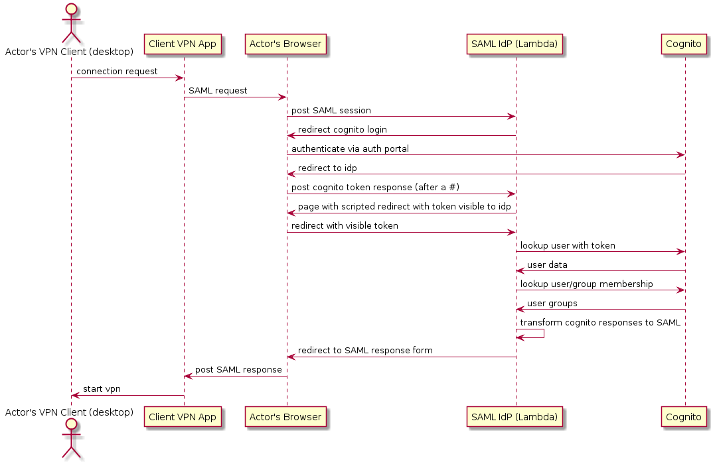
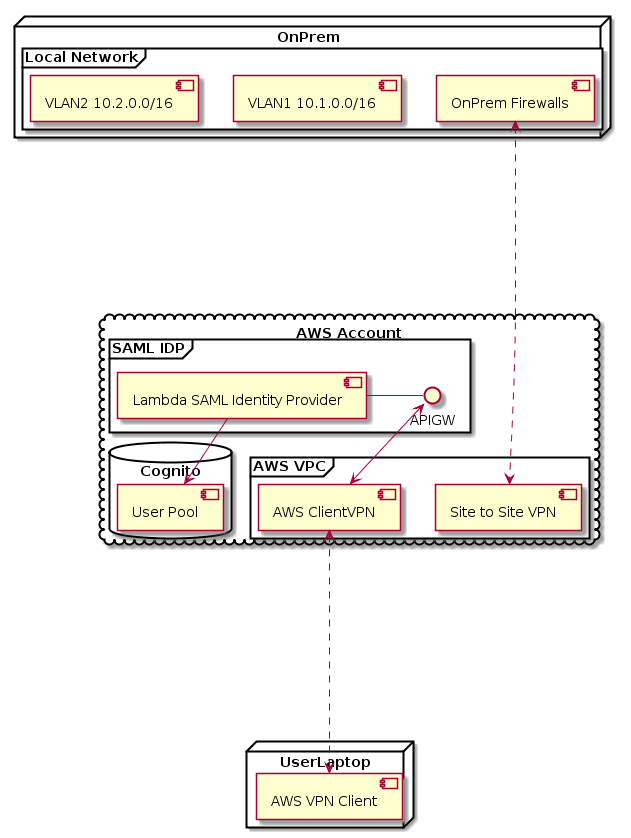
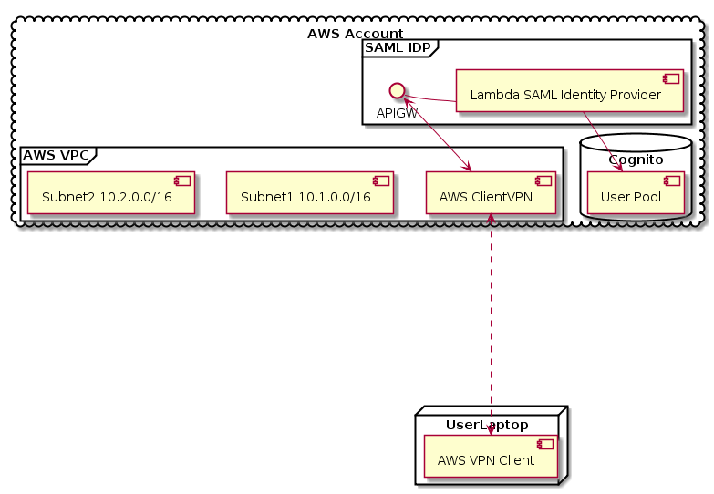

# HOW TO USE

# Setting things up

## Set up your development environment

### Docker

You will need to have docker installed
and able to run containers as your user

### Python3.6 and virtualenv

You will need python3.6 and the appropriate
modules to use virtualenv

##  AWS Account Credentials

You will need to have AWS Account Credentials
Configured, whether with environment variables,
a ~/.aws/config file, or something else.

## Setting up Certificates

### IDP Cert

Create certificates for your SAML Identity Provider (IDP). Put the
public certificate into chalicelib/mycert.pem and the private key
into chalicelib/mykey.pem.

If you do not have a certificate, you can generate your own, self-signed,
certificate by running:

```
openssl req -x509 -nodes -days 3000 -newkey rsa:1024 -keyout chalicelib/mykey.pem -out chalicelib/mycert.pem
```

### ClientVPN Endpoint certificate

Create an AWS ACM Certificate in your region via the console. When
complete, edit "make-clientvpn.sh" and "update-clientvpn.sh" to include
the certificate ARN.

## Edit Cloudformation Scripts
### ClientVPN edit REGION, VPC, and subnet id

edit "make-clientvpn.sh" and "update-clientvpn.sh" and update the vpc id
and subnet id to match your vpc and subnet.

### Cognito edit REGION, VPC, and subnet id

edit "make-cognito.sh" and "update-cognito.sh" and update the region


## prep python dependencies

### set up virtual env

this assumes python3.6, and has (so far) only been tested with 3.6, but
it should work with other versions.

```
virtualenv --python python3.6 venv36

. ./venv36/bin/activate

pip install -r requirements.txt
```

### set up binary dependencies needed by lambda

Lambda needs some compiled C code, this script
uses a docker container to ensure that you have the
correct binary format. Note: this needs to be run
on an x86-64 processor.

Run:

```
./install_deps.sh
```

## create the chalice app

```
chalice deploy
```

## create the cognito cloudformation stack

```
./make-cognito.sh
```

## grab data from cognito stack

### record variables for the app

```
python ./recordresources.py --stack-name=Cognito
```

### update the policy document, change:

optional, but highly recommended:

edit .chalice/my-policy.json

change the resource "arn:aws:cognito-idp:*" to be the ARN for
the cognito user pool (this is to ensure the app
can only operate against that user pool)


## update the chalice app

```
chalice deploy
```

## modify the clientvpn stack

### Add any needing authorization rules

I put in two example rules, add/update as appropriate, modify
the cognito stack to have matching groups.

## update the cognito stack with updated groups

```
./update-cognito.sh
```

## deploy the clientvpn stack

```
./make-clientvpn.sh
```

## Add users

go to your cognito user pool and add users. Put them in appropriate groups


## Finished

Have your users try things out.

# How this works

AWS ClientVPN doesn't currently support directly authenticating against AWS Cognito User Pools. This system provides a SAML Identity Provider (IDP) which brokers authentication requests from AWS ClientVPN to AWS Cognito.

## Sequence Diagram





## Example Architecture Diagrams

### On Prem
This is an example network/VPC which inclines an on-prem network connected via Site-to-site VPN into a VPC with ClientVPN being used to provide remote access.





### VPC

This is a VPC only diagram, show ClientVPN being used to provide
access to subnets within a VPC




